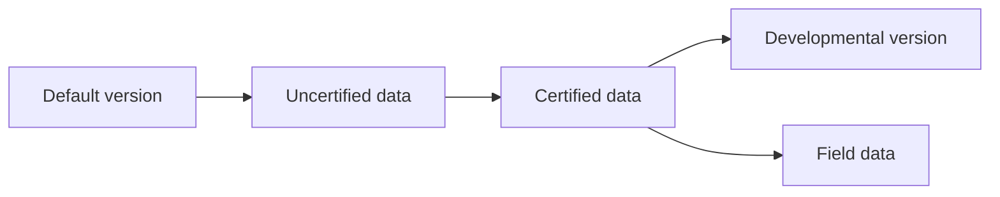

# README

These files are used to generate an HTML report that shows the pairwise differences between geopackage (.gpkg) files. The report lists differences in layers, table columns, and rows (i.e., inserted, deleted, and updated rows). Multiple pairwise comparisons can be included in the same report.

In each pairwise comparison of the report, the original version is called "A" and the modified version is called "B." Inserted and deleted rows are relative to the original or A version. Therefore, rows that are present only in A will be listed under the deleted rows, and rows present only in B are under the inserted rows.

## File descriptions

- custom_diff_functions.py: Functions called by the report generation script. Includes functions that read geopackages into dictionaries and find differences between the datasets.
- report_specifications.py: Not included in the repo, but a template for the file is in the usage section below. This file specifies the information that should be included in the HTML report.
- data_difference_report.py: This script generates the HTML report and calls custom_diff_functions.py and report_specifications.py.

## Usage

Using the template in the next section, create a file in this folder called report_specifications.py that specifies variables for the HTML report. Then run the report generation script:

```python
python data_difference_report.py
```

## Template for report_specifications.py

Create a report_specifications.py file with the variables in this template.

-	create_diagram: Logical. Whether to produce a Mermaid chart of the version tree. Set to "False" if using a pre-existing image of the version tree.
-	version_tree_image: File name for the image of the version tree. If `create_diagram = True`, this must be an .svg file.
-	version_tree_mmd: Code block to produce a version tree Mermaid chart. See note on Mermaid below.
-	out_html_name: Name of HTML report to be exported.
-	comparisons: Dictionary of pair-wise version comparisons to include in the report. The number of comparisons (i.e., number of keys in the dictionary) can be changed.

```python
create_diagram = False
version_tree_image = 'file_name.png'
version_tree_mmd = """
flowchart LR
    A[Default version] --> B[Uncertified data]
    B --> C[Certified data]
    C --> D[Developmental version]
    C --> E[Field data]
"""

out_html_name = 'path/to/report_file.html'

comparisons = {
    1:{
      'name': 'gpkg A to gpkg B',
      'original': r'path/to/version_A.gpkg',
      'changed': r'path/to/version_B.gpkg'
      },
  
    2:{
      'name': 'gpkg A to gpkg C',
      'original': r'path/to/version_A.gpkg',
      'changed': r'path/to/version_C.gpkg'
      },
    
    3:{
      'name': 'gpkg D to gpkg E',
      'original': r'path/to/version_D.gpkg',
      'changed': r'path/to/version_E.gpkg'
      }
}
```
---

## Mermaid charts

Mermaid renders charts from text. This report uses a flowchart that shows how SDE versions are related to one another. When one version branches off from another, an arrow will point from the original to the new version. A --> B indicates that B branched off from A. Names for each version should be included in square brackets, but only upon first introduction of the version. For example, the following text will generate the chart below it.

flowchart LR\
    A[Default version] --> B[Uncertified data]\
    B --> C[Certified data]\
    C --> D[Developmental version]\
    C --> E[Field data]

